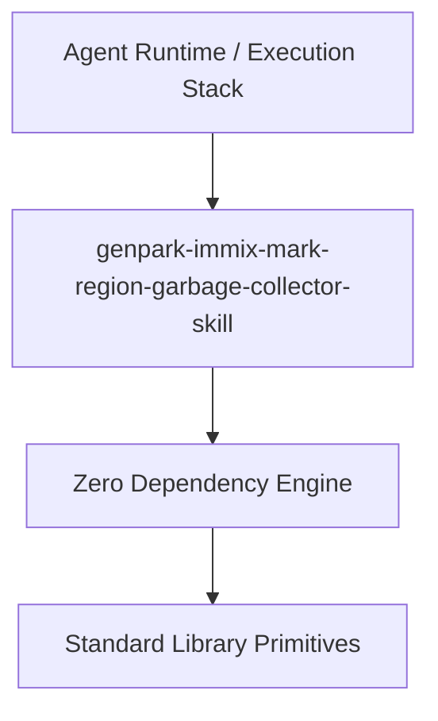

# genpark-immix-mark-region-garbage-collector-skill

[](https://github.com/alphaparkinc/genpark-immix-mark-region-garbage-collector-skill)
[](https://github.com/alphaparkinc/genpark-immix-mark-region-garbage-collector-skill)
[](https://www.python.org/)

Immix mark-region garbage collector utilizing hierarchical block and line marks, fine-grained object allocation, and opportunistic mark-sweep-evacuate defragmentation.



## Features
- **Strict 0 Pip Dependencies**: Built completely using the Python Standard Library.
- **Fast Execution & Verification**: Includes client wrapper, MCP server, and verified test suites.
- **Agentic AI Ready**: Exposes standard MCP tools for continuous LLM integration.

## Installation & Quickstart
```bash
git clone https://github.com/alphaparkinc/genpark-immix-mark-region-garbage-collector-skill.git
cd genpark-immix-mark-region-garbage-collector-skill
python example_usage.py
```
